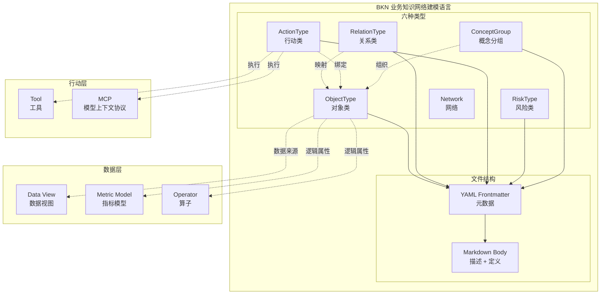
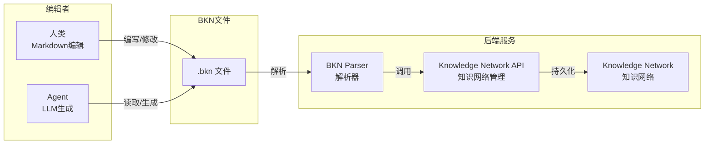
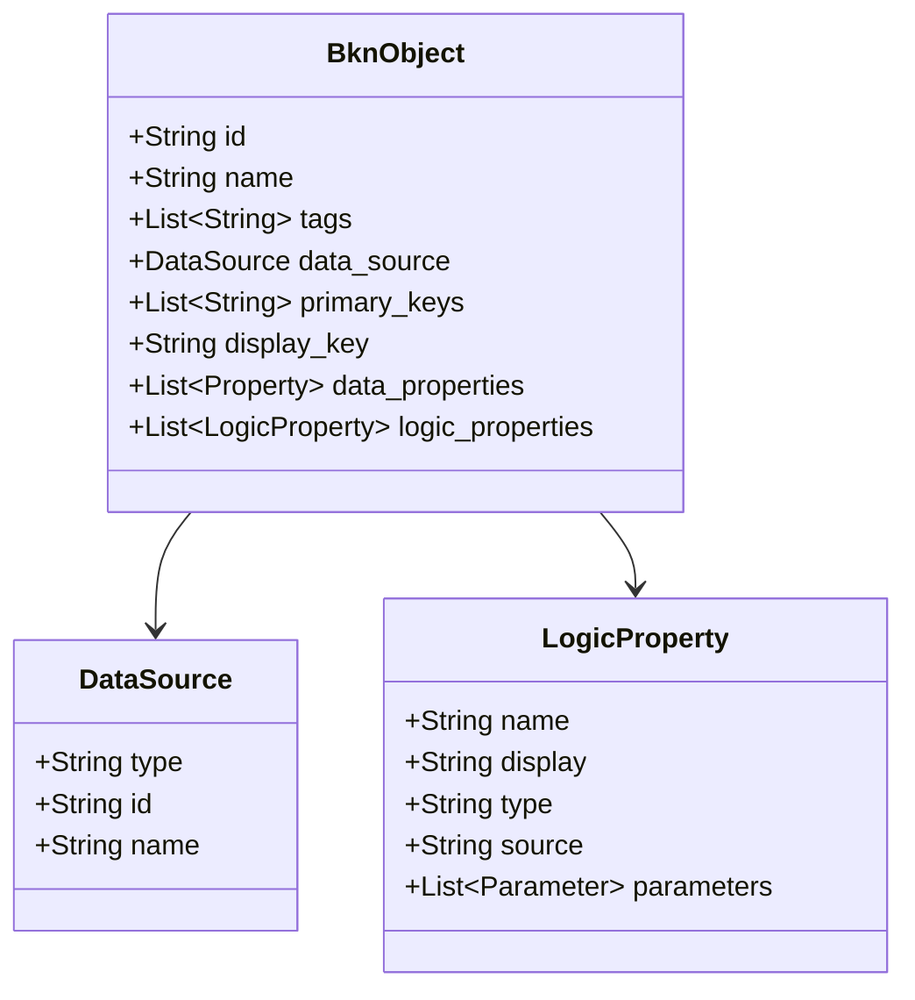
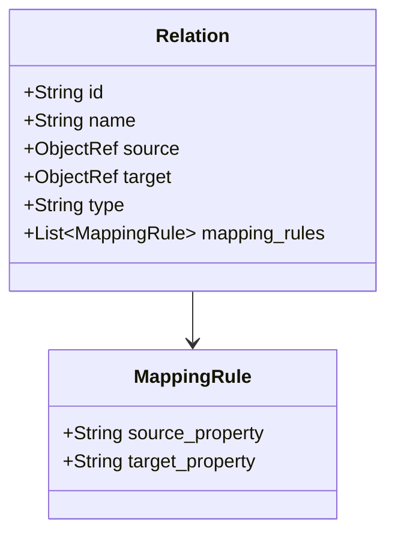
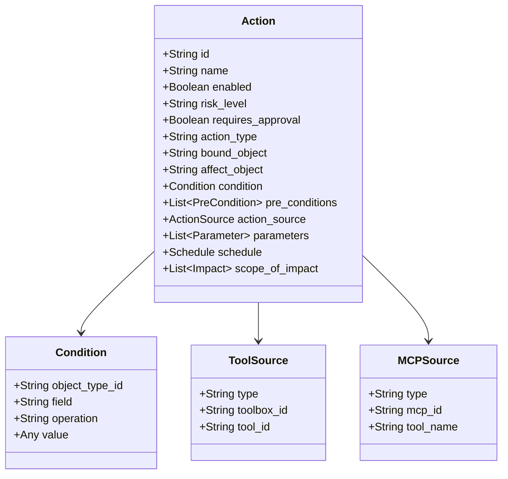
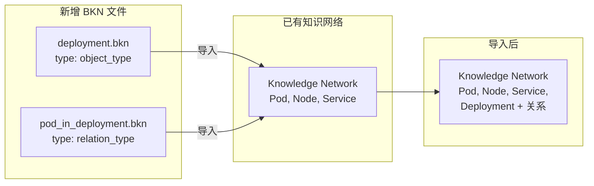

# BKN 架构设计

BKN (Business Knowledge Network) 是一种 Markdown-based 的业务知识网络建模语言，用于描述业务知识网络中的对象、关系和行动。

## 设计理念

- **人类可读**: 使用 Markdown 语法，业务人员也能理解和编辑
- **Agent 友好**: 结构化的 YAML frontmatter + 语义化的 section，便于 LLM 解析和生成
- **增量导入**: 任何 `.bkn` 文件可直接导入到已有的知识网络，支持动态更新
- **大规模友好**: 每个定义独立一个文件，100 个对象 = 100 个小文件

## 架构概览



## 工作流



## 六种类型

### 对象类 (ObjectType)

描述业务对象，如 Pod、Node、Service 等。

**核心特性**:
- 声明数据属性（Data Properties）和键定义（Keys）
- 可选映射数据视图（Data Source）
- 支持逻辑属性（指标、算子等）



### 关系类 (RelationType)

描述两个对象之间的关联关系。

**核心特性**:
- 定义起点和终点对象（Endpoint）
- 支持直接映射（direct）和视图映射（data_view）
- 声明属性映射规则



### 行动类 (ActionType)

描述可执行的操作，绑定工具或 MCP。

**核心特性**:
- 绑定目标对象（Bound Object）
- 定义触发条件（Trigger Condition）
- 配置执行工具和参数（Tool Configuration / Parameter Binding）
- 支持调度配置（Schedule）
- 可声明前置条件（Pre-conditions）和影响范围（Scope of Impact）



### 风险类 (RiskType)

对行动类和对象类的执行风险进行结构化建模。风险类型是独立类型，不是行动类型的附属字段。

**核心特性**:
- 管控范围（Control Scope）
- 管控策略（Control Policy）
- 前置检查（Pre-checks）
- 回滚方案（Rollback Plan）
- 审计要求（Audit Requirements）

### 概念分组 (ConceptGroup)

将相关的对象类型组织在一起，便于理解和管理。

**核心特性**:
- 包含的对象类型列表（Object Types）
- 提供业务领域的逻辑分组

## 文件组织

每个对象/关系/行动/风险/概念分组独立一个文件，以 `network.bkn` 为根文件入口。

```
{business_dir}/
├── SKILL.md                     # agentskills.io 标准入口
├── network.bkn                  # 网络根文件（type: network）
├── CHECKSUM                     # 可选，目录级一致性校验
├── object_types/
│   ├── pod.bkn                  # type: object_type
│   ├── node.bkn                 # type: object_type
│   └── service.bkn              # type: object_type
├── relation_types/
│   ├── pod_belongs_node.bkn     # type: relation_type
│   └── service_routes_pod.bkn   # type: relation_type
├── action_types/
│   ├── restart_pod.bkn          # type: action_type
│   └── cordon_node.bkn          # type: action_type
├── risk_types/
│   └── restart_pod_high_risk.bkn # type: risk_type
├── concept_groups/
│   └── k8s.bkn                  # type: concept_group
└── data/                        # 可选，.csv 实例数据
    └── scenario.csv
```

**优势**：
- 每个文件 50-100 行，人类易读
- LLM 处理时无 token 限制问题
- 便于团队协作和版本控制
- 支持按需加载

## 增量导入机制

BKN 的核心特性是支持**动态增量导入**：任何 `.bkn` 文件可直接导入到已有的知识网络。



### 导入行为

| 场景 | 行为 |
|------|------|
| ID 不存在 | 新增定义 |
| ID 已存在 | 更新定义（覆盖） |
| 删除定义 | 通过 SDK/CLI 的 delete API 显式执行，不通过 BKN 文件 |

### 支持的文件类型

| type | 说明 | 用途 |
|------|------|------|
| `network` | 完整知识网络 | 初始化或全量导入 |
| `object_type` | 单个对象类型定义 | 增量添加/更新对象 |
| `relation_type` | 单个关系类型定义 | 增量添加/更新关系 |
| `action_type` | 单个行动类型定义 | 增量添加/更新行动 |
| `risk_type` | 单个风险类型定义 | 增量添加/更新风险 |
| `concept_group` | 概念分组 | 增量添加/更新分组 |

### 典型工作流

1. **初始化**: 导入 `network` 类型的完整定义
2. **扩展**: 导入单个 `object_type` / `relation_type` / `action_type` / `risk_type` 文件
3. **修改**: 导入同 ID 的文件，自动覆盖
4. **删除**: 调用 SDK/CLI 的 delete API

## 与 知识网络管理 API 的映射

> 说明：接口路径仅用于表达 BKN 概念与系统 API 的对应关系，具体实现路径以实际部署为准。

| BKN 概念 | API 端点 |
|----------|----------|
| ObjectType | `/api/knowledge-networks/{kn_id}/object-types` |
| RelationType | `/api/knowledge-networks/{kn_id}/relation-types` |
| ActionType | `/api/knowledge-networks/{kn_id}/action-types` |

## 参考

- [BKN 语言规范](./SPECIFICATION.md)
- [BKN vs RESTful API 对比](./BKN_vs_REST_API.md)
- 样例：
  - [K8s 网络](../examples/k8s-network/) - K8s 拓扑知识网络
  - [供应链网络](../examples/supplychain-hd/) - 供应链业务知识网络
