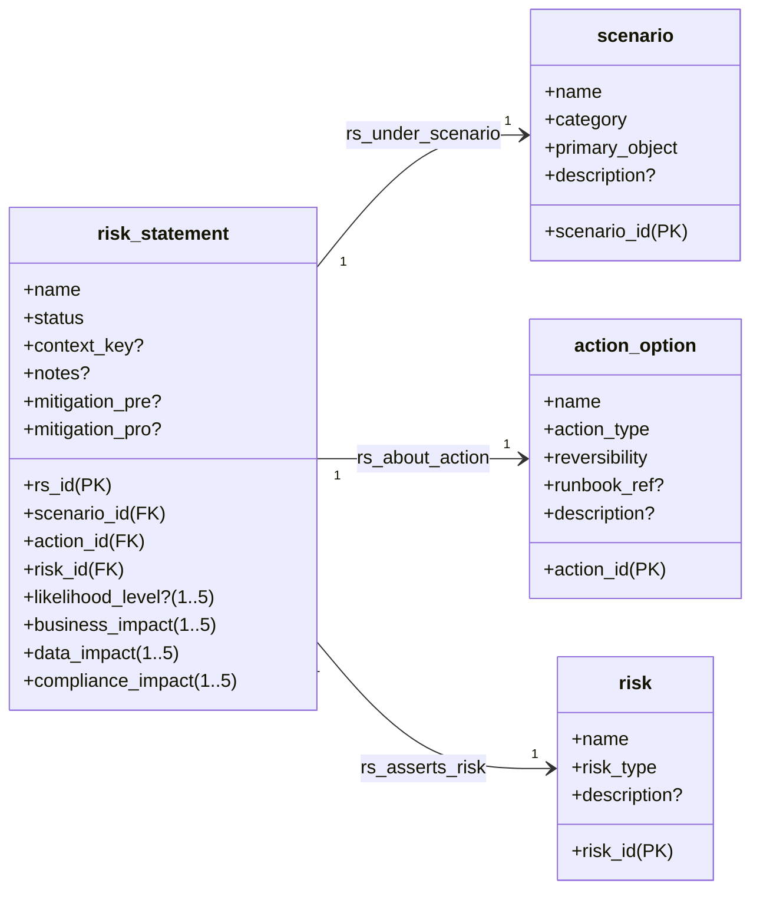
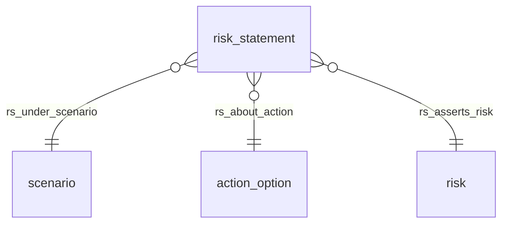

# DR Static Risk Knowledge - 参考文档

本文档对 [risk-fragment.bkn](risk-fragment.bkn) 中定义的静态风险知识模型进行说明，便于理解实体、关系及业务语义。

## 模型概述

静态风险知识不描述 incident / risk event，不记录风险事件，只为风险操作提供参考。风险以「动作 × 场景 × 风险类型」的断言形式存在，由 `risk_statement` 表达。

## 实体关系图

## 实体与字段说明

### scenario — 风险场景

风险发生的场景，是「情况类型」，可被多个 RiskStatement 复用。Scenario 不包含阈值、触发器与执行策略。

| 字段 | 类型 | 必填 | 约束 | 说明 |
|------|------|:----:|------|------|
| scenario_id | VARCHAR | 是 | `not_null; regex:^[a-z0-9_\\-]+$` | 场景唯一标识，主键 |
| name | VARCHAR | 是 | `not_null` | 场景名称，展示键 |
| category | VARCHAR | 是 | `in(availability, integrity, security, performance, dependency, operator)` | 场景分类，用于分组和筛选 |
| primary_object | VARCHAR | 是 | `not_null` | 主要影响对象，如某个系统、资源或数据域的引用 |
| description | TEXT | 否 | — | 场景的详细说明，支持全文检索 |

**category 取值**：

| 值 | 含义 |
|----|------|
| availability | 可用性相关场景（如服务中断、节点不可达） |
| integrity | 完整性相关场景（如数据损坏、校验失败） |
| security | 安全相关场景（如未授权访问、凭证泄露） |
| performance | 性能相关场景（如延迟飙升、资源耗尽） |
| dependency | 依赖相关场景（如上游服务故障、第三方不可用） |
| operator | 操作人员相关场景（如误操作、配置变更） |

---

### action_option — 动作选项

风险发生后可执行的动作选项，是「策略选项/手段词条」，不是一次具体执行事件。不包含「是否应该执行」的判断，判断由 RiskStatement/Policy 等上层对象承担。

| 字段 | 类型 | 必填 | 约束 | 说明 |
|------|------|:----:|------|------|
| action_id | VARCHAR | 是 | `not_null; regex:^[a-z0-9_\\-]+$` | 动作唯一标识，主键 |
| name | VARCHAR | 是 | `not_null` | 动作名称（如 failover / wait / restore），展示键 |
| action_type | VARCHAR | 是 | `in(failover, wait, restore, rollback, degrade, isolate, rebuild)` | 动作类型，用于分类和 Agent 决策 |
| reversibility | VARCHAR | 是 | `in(reversible, partially_reversible, irreversible)` | 可逆性，Agent 评估风险时的关键因素 |
| runbook_ref | VARCHAR | 否 | — | 可选的 Runbook 或操作流程引用链接，支持精确匹配 |
| description | TEXT | 否 | — | 动作的详细说明，支持全文检索 |

**action_type 取值**：

| 值 | 含义 |
|----|------|
| failover | 故障转移（切换到备用系统） |
| wait | 等待/观察（不主动干预） |
| restore | 恢复（从备份恢复） |
| rollback | 回滚（撤销变更） |
| degrade | 降级（减少功能保核心可用） |
| isolate | 隔离（切断故障域扩散） |
| rebuild | 重建（销毁并重新创建） |

**reversibility 取值**：

| 值 | 含义 |
|----|------|
| reversible | 完全可逆，可安全撤销 |
| partially_reversible | 部分可逆，可能有残留影响 |
| irreversible | 不可逆，执行后无法恢复原状 |

---

### risk — 风险类型

静态风险类型定义，只定义「风险是什么」，不定义「在什么条件下发生」。「在某场景执行某动作会引入某风险」由 RiskStatement 表达。

| 字段 | 类型 | 必填 | 约束 | 说明 |
|------|------|:----:|------|------|
| risk_id | VARCHAR | 是 | `not_null; regex:^[a-z0-9_\\-]+$` | 风险唯一标识，主键 |
| name | VARCHAR | 是 | `not_null` | 风险名称（如数据回滚、数据不一致），展示键 |
| risk_type | VARCHAR | 是 | `in(data_loss, inconsistency, availability, security, compliance, financial, reputation)` | 风险类型 |
| description | TEXT | 否 | — | 风险的定义与边界说明，支持全文检索 |

**risk_type 取值**：

| 值 | 含义 |
|----|------|
| data_loss | 数据丢失 |
| inconsistency | 数据不一致 |
| availability | 可用性下降或中断 |
| security | 安全风险 |
| compliance | 合规风险 |
| financial | 财务损失 |
| reputation | 声誉影响 |

---

### risk_statement — 风险断言

静态风险断言（组合对象）：在某场景下执行某动作会引入某类风险。是表达「某个 action 的风险」的最小主语对象，可版本化、可评审、可退役，不代表风险已发生。

| 字段 | 类型 | 必填 | 约束 | 说明 |
|------|------|:----:|------|------|
| rs_id | VARCHAR | 是 | `not_null; regex:^[a-z0-9_\\-]+$` | 风险断言唯一标识，主键 |
| name | VARCHAR | 是 | `not_null` | 断言名称，展示键 |
| status | VARCHAR | 是 | `in(active, retired, draft)` | 生命周期状态 |
| context_key | VARCHAR | 否 | — | 可选上下文限定（如 `order-db/prod/eu-central-1`），用于约束断言的生效范围 |
| scenario_id | VARCHAR | 是 | `not_null` | 关联场景的外键，指向 `scenario.scenario_id` |
| action_id | VARCHAR | 是 | `not_null` | 关联动作的外键，指向 `action_option.action_id` |
| risk_id | VARCHAR | 是 | `not_null` | 关联风险类型的外键，指向 `risk.risk_id` |
| likelihood_level | int32 | 否 | `range(1,5)` | 经验发生倾向（1=极低, 5=极高），基于经验判断而非统计概率 |
| business_impact | int32 | 否 | `range(1,5)` | 业务影响等级（1=可忽略, 5=灾难性） |
| data_impact | int32 | 否 | `range(1,5)` | 数据影响等级（1=可忽略, 5=灾难性） |
| compliance_impact | int32 | 否 | `range(1,5)` | 合规影响等级（1=可忽略, 5=灾难性） |
| notes | TEXT | 否 | — | 解释、证据或经验记录，支持全文检索 |
| mitigation_pre | TEXT | 否 | — | 事前缓解措施建议 |
| mitigation_pro | TEXT | 否 | — | 事后缓解措施建议 |

**status 取值**：

| 值 | 含义 |
|----|------|
| active | 生效中，Agent 决策时应参考 |
| draft | 草稿，待评审确认 |
| retired | 已退役，仅保留历史参考 |

**影响等级量表** (likelihood_level / business_impact / data_impact / compliance_impact)：

| 等级 | 含义 |
|------|------|
| 1 | 可忽略 |
| 2 | 轻微 |
| 3 | 中等 |
| 4 | 严重 |
| 5 | 灾难性 |

## 关系说明

| 关系 | 说明 |
|------|------|
| **rs_under_scenario** | 每个 risk_statement 必须关联且仅关联一个 scenario |
| **rs_about_action** | 每个 risk_statement 必须关联且仅关联一个 action_option |
| **rs_asserts_risk** | 每个 risk_statement 必须关联且仅关联一个 risk |

## 参考

- BKN 定义：[risk-fragment.bkn](risk-fragment.bkn)
- 网络：`recoverable-network`，命名空间：`resilience.dr`
