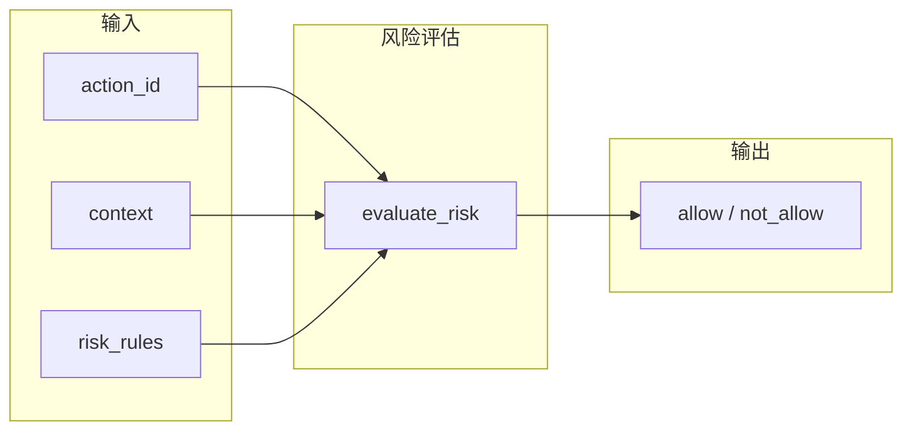

# Risk 风险类设计与交互逻辑

本文档描述 BKN 中**风险（risk）**的设计定位、风险相关实体/关系，以及风险评估与执行的交互逻辑。对应 BKN 定义见 [index.bkn](index.bkn)（聚合 [risk-fragment.bkn](risk-fragment.bkn) 与 [actions.bkn](actions.bkn)）。

---

## 1. 风险类的设计定位

### 1.1 内置 tag `__risk__`（保留，用户不得使用）

- **`__risk__`** 为规范**内置保留** tag，仅用于参与「内置风险评估」的实体与关系；**用户不得将 `__risk__` 用于自定义用途**。
- 凡参与**内置**风险评估的定义，在头部增加 **`- **Tags**: __risk__`**。AI 应用与内置评估模块通过该 tag 识别风险相关定义。

### 1.2 与 Action 的关系

- **Action** 拥有**运行时/计算属性** `risk`，取值仅 **`allow`** 或 **`not_allow`**。
- 该属性**不写入 BKN 文件**，可由**内置或用户提供的风险评估函数**根据「当前场景 + 带 `__risk__` tag 的知识（规则实例）」计算得出。
- 规范中 Action 的静态 **`risk_level`**（low/medium/high）与动态 **`risk`**（allow/not_allow）分离：前者用于展示与审批，后者用于执行门控。

### 1.3 开放性：自定义风险类与评估函数

- 用户可按需求定义**自己的风险类**：使用**非保留** tag（如 `compliance`、`audit`）定义实体/关系，不参与内置评估，由用户自己的逻辑消费。
- 用户可提供**自己的风险评估函数**：签名与内置 `evaluate_risk` 兼容（如 `(network, action_id, context, **kwargs) -> str`），在运行时替换或与内置评估组合使用。
- 内置的 `__risk__` 与默认 `evaluate_risk` 仅为一种可选实现，不排斥用户扩展或替换。

---

## 2. 风险相关实体与关系

### 2.1 实体概览

| 定义 | 类型 | 说明 | Tags |
|------|------|------|------|
| **risk_scenario** | Entity | 风险发生的场景（在何种情况下考虑风险） | __risk__ |
| **risk_rule** | Entity | 风险规则：在某场景下对某 Action 是否允许执行 | __risk__ |
| **rule_under_scenario** | Relation | 规则归属场景（risk_rule → risk_scenario） | __risk__ |

### 2.2 risk_scenario（风险场景）

- **主键**：`scenario_id`（VARCHAR, not_null, regex:`^[a-z0-9_\-]+$`）
- **属性**：

| Property | Type | Constraint | 说明 |
|----------|------|------------|------|
| scenario_id | VARCHAR | not_null; regex | 场景唯一标识（主键） |
| name | VARCHAR | not_null | 场景名称（Display Key） |
| category | VARCHAR | in(availability,integrity,security,performance,dependency,operator) | 场景分类 |
| primary_object | VARCHAR | not_null | 主要影响对象 |
| description | TEXT | | 场景说明 |
| activation_rule | TEXT | | 场景生效条件（如时间窗口规则） |

- **语义**：描述「在什么情况下」需要做风险判断（例如：某系统、某时段、某环境）。评估时通过 **context** 中的 `scenario_id` 与场景对应。`activation_rule` 存放场景的生效条件（如 `day in [28,29,30] with hour>=23 on 28th; day 31 with hour<4`），替代独立的 `scenario_activation.json`。

### 2.3 risk_rule（风险规则）

- **主键**：`rule_id`（VARCHAR, not_null, regex:`^[a-z0-9_\-]+$`，格式为 `{scenario_id}_{action_id}`）
- **属性**：

| Property | Type | Constraint | 说明 |
|----------|------|------------|------|
| rule_id | VARCHAR | not_null; regex | 规则唯一标识（主键） |
| scenario_id | VARCHAR | not_null; regex | 适用场景 ID |
| action_id | VARCHAR | not_null; regex | 涉及的 Action ID |
| allowed | bool | not_null | 该场景下该 action 是否允许 |
| reason | TEXT | | 原因说明 |

- **语义**：一条规则即「在 scenario_id 下，对 action_id 的允许结果为 allowed」。评估时用规则实例列表（risk_rules）匹配当前 context 与待执行 action，得到 allow/not_allow。

### 2.4 Relation: rule_under_scenario

- **Source**: `risk_rule` → **Target**: `risk_scenario`
- **Mapping**: `risk_rule.scenario_id` → `risk_scenario.scenario_id`
- **基数**: N:1（多条规则属于同一场景）
- **语义**：每条风险规则归属于一个风险场景。评估时按 context 中的 `scenario_id` 匹配场景，再查找该场景下的规则。

---

## 3. 交互逻辑

### 3.1 评估流程概览



- **输入**：待执行的 `action_id`、当前 **context**（至少包含 `scenario_id`）、以及可选规则实例列表 **risk_rules**（来自图库/API/配置）。
- **输出**：**allow** 或 **not_allow**，供执行侧决定是否放行该 action。

### 3.2 context（上下文）

- 通常为键值对，至少包含 **`scenario_id`**，用于与 risk_rule 的 `scenario_id` 匹配。
- 可扩展其他键（如 `region`、`env`），供未来规则或策略使用；当前 SDK 仅使用 `scenario_id`。

### 3.3 risk_rules（规则实例）

- **来源**：BKN 只定义 risk_scenario / risk_rule 的**结构**；规则**实例数据**由上层从图库、数据库或配置中加载，并以列表形式传入 `evaluate_risk`。
- **每条规则**至少需包含：`scenario_id`、`action_id`、**`allowed`**（bool）。可选包含 `rule_id`、`reason` 等，供日志与展示。
- **匹配规则**：当某条规则的 `action_id` 与入参一致，且 `scenario_id` 与 context 中的一致（或 context 未提供 scenario_id 时不按场景过滤）时，该条规则参与判定。

### 3.4 评估结果规则

- 若存在**任意一条**匹配规则且 **`allowed == False`**，则返回 **not_allow**。
- 否则（无匹配规则，或所有匹配规则均为 allowed=True）返回 **allow**。
- **默认策略**：当未传入 risk_rules 或没有任何规则匹配时，结果为 **allow**（默认放行）；显式禁止依赖「存在 allowed=False 的规则」。

### 3.5 与执行侧的交互

- **allow**：执行侧可以执行该 Action；若规则中带有额外约束（如限流、脱敏），由执行侧根据规则元数据自行处理。
- **not_allow**：执行侧应阻断该 Action，并可按规则原因或策略 ID 做告警、审批流转等。

---

## 4. 具体示例

以下示例均基于本目录中的实际数据（`data/risk_scenario.bknd`、`data/risk_rule.bknd`、`actions.bkn`）。

### 4.1 示例一：月末封网 — 绝对阻断（not_allow）

**场景**：2026-02-28 23:00，运维 AI 尝试重启 ERP 系统。

| 要素 | 值 |
|------|-----|
| scenario_id | `sec_t_01` |
| 场景名称 | SEC-T-01: 月末财务绝对封网 |
| activation_rule | `day in [28,29,30] with hour>=23 on 28th; day 31 with hour<4` |
| action_id | `restart_erp` |
| 对应规则 | `sec_t_01_restart_erp`（allowed=**false**） |
| **评估结果** | **not_allow** |

```python
from bkn.loader import load_network
from bkn.risk import evaluate_risk

network = load_network("examples/risk/index.bkn")

risk_rules = [
    {
        "rule_id": "sec_t_01_restart_erp",
        "scenario_id": "sec_t_01",
        "action_id": "restart_erp",
        "allowed": False,
        "reason": "SEC-T-01: 月末财务绝对封网; control_action=absolute_block",
    },
]

result = evaluate_risk(
    network, "restart_erp", {"scenario_id": "sec_t_01"}, risk_rules=risk_rules
)
assert result == "not_allow"
```

> 同一场景下 `restart_pod` 和 `ddl_alter` 也会被阻断（均有 allowed=false 的规则）。

### 4.2 示例二：雪崩防波及 — 允许但需限流（allow）

**场景**：AI 试图一次性重启超过 20% 的 K8s 节点。

| 要素 | 值 |
|------|-----|
| scenario_id | `sec_c_02` |
| 场景名称 | SEC-C-02: 雪崩防波及驱逐限制 |
| action_id | `batch_restart_nodes` |
| 对应规则 | `sec_c_02_batch_restart_nodes`（allowed=**true**） |
| **评估结果** | **allow**（执行侧需按 reason 中的 `control_action=throttle` 限流） |

```python
risk_rules = [
    {
        "rule_id": "sec_c_02_batch_restart_nodes",
        "scenario_id": "sec_c_02",
        "action_id": "batch_restart_nodes",
        "allowed": True,
        "reason": "SEC-C-02: 雪崩防波及; control_action=throttle; auth_level=HotL",
    },
]

result = evaluate_risk(
    network, "batch_restart_nodes", {"scenario_id": "sec_c_02"}, risk_rules=risk_rules
)
assert result == "allow"
```

> `evaluate_risk` 返回 allow，但 reason 中携带 `control_action=throttle`，执行侧可据此做限流处理。

### 4.3 示例三：跨网段红线 — 强拦截（not_allow）

**场景**：AI 尝试开通办公网 → 生产网的防火墙白名单。

| 要素 | 值 |
|------|-----|
| scenario_id | `sec_n_01` |
| 场景名称 | SEC-N-01: 跨网段网络隔离红线 |
| action_id | `open_firewall_rule` |
| 对应规则 | `sec_n_01_open_firewall_rule`（allowed=**false**） |
| **评估结果** | **not_allow** |

```python
risk_rules = [
    {
        "rule_id": "sec_n_01_open_firewall_rule",
        "scenario_id": "sec_n_01",
        "action_id": "open_firewall_rule",
        "allowed": False,
        "reason": "SEC-N-01: 跨网段网络隔离红线; control_action=direct_reject",
    },
]

result = evaluate_risk(
    network, "open_firewall_rule", {"scenario_id": "sec_n_01"}, risk_rules=risk_rules
)
assert result == "not_allow"
```

### 4.4 示例四：无规则匹配 — 默认放行（allow）

**场景**：规则列表中没有当前 scenario + action 的条目。

```python
risk_rules = [
    {"scenario_id": "sec_t_01", "action_id": "restart_erp", "allowed": False},
]

# action_id 为 deploy_firmware，但规则中只有 sec_t_01 + restart_erp，不匹配
result = evaluate_risk(
    network, "deploy_firmware", {"scenario_id": "sec_t_01"}, risk_rules=risk_rules
)
assert result == "allow"

# 不传入任何规则时，也默认 allow
result = evaluate_risk(network, "restart_erp", {"scenario_id": "sec_t_01"})
assert result == "allow"
```

> 默认策略：无匹配规则 → allow。只有存在 `allowed=False` 的匹配规则才会返回 not_allow。

### 4.5 示例五：批量加载规则实例

实际使用中，规则通常从 `data/security_contract_rules.json` 或图库 API 批量加载，而非手动构造：

```python
import json
from pathlib import Path

rules_path = Path("examples/risk/data/security_contract_rules.json")
raw_rules = json.loads(rules_path.read_text())

risk_rules = [
    {
        "scenario_id": r["scenario_id"],
        "action_id": r["action_id"],
        "allowed": r["allowed"],
        "reason": r.get("reason", ""),
    }
    for r in raw_rules
]

# 在 sec_p_01（Root/Admin 提权阻断）场景下尝试授予超级权限
result = evaluate_risk(
    network, "grant_root_admin", {"scenario_id": "sec_p_01"}, risk_rules=risk_rules
)
assert result == "not_allow"

# 在 sec_d_03（核心商业机密防外泄）场景下查询敏感数据 — allowed=true，可执行但需脱敏
result = evaluate_risk(
    network, "query_sensitive_data", {"scenario_id": "sec_d_03"}, risk_rules=risk_rules
)
assert result == "allow"
```

---

## 5. 参考

- BKN 定义：[index.bkn](index.bkn)、[risk-fragment.bkn](risk-fragment.bkn)、[actions.bkn](actions.bkn)
- 规范：`docs/SPECIFICATION.md` 中「风险相关定义」「Action risk（计算属性）」
