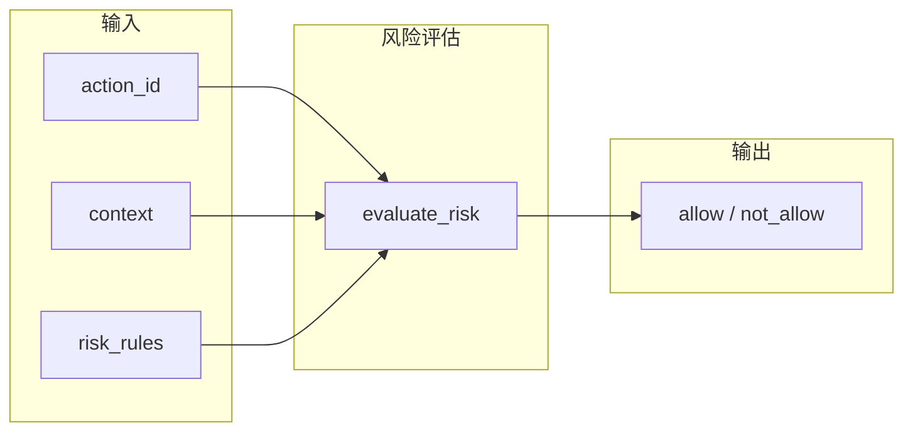

# Risk 风险类设计与交互逻辑

本文档描述 BKN 中**风险（risk）**的设计定位、风险相关实体/关系，以及风险评估与执行的交互逻辑。对应 BKN 定义见 [risk-fragment.bkn](risk-fragment.bkn)。

---

## 1. 风险类的设计定位

### 1.1 内置 tag `__risk__`（保留，用户不得使用）

- **`__risk__`** 为规范**内置保留** tag，仅用于参与「内置风险评估」的实体与关系；**用户不得将 `__risk__` 用于自定义用途**。
- 凡参与**内置**风险评估的定义，在头部增加 **`- **Tags**: __risk__`**。AI 应用与内置评估模块通过该 tag 识别风险相关定义。

### 1.2 与 Action 的关系

- **Action** 拥有**运行时/计算属性** `risk`，取值仅 **`allow`** 或 **`not_allow`**。
- 该属性**不写入 BKN 文件**，可由**内置或用户提供的风险评估函数**根据「当前场景 + 带 `__risk__` tag 的知识（规则实例）」计算得出。
- 规范中 Action 的静态 **`risk_level`**（low/medium/high）与动态 **`risk`**（allow/not_allow）分离：前者用于展示与审批，后者用于执行门控。

### 1.3 开放性：自定义风险类与评估函数

- 用户可按需求定义**自己的风险类**：使用**非保留** tag（如 `compliance`、`audit`）定义实体/关系，不参与内置评估，由用户自己的逻辑消费。
- 用户可提供**自己的风险评估函数**：签名与内置 `evaluate_risk` 兼容（如 `(network, action_id, context, **kwargs) -> str`），在运行时替换或与内置评估组合使用。
- 内置的 `__risk__` 与默认 `evaluate_risk` 仅为一种可选实现，不排斥用户扩展或替换。

---

## 2. 风险相关实体与关系

### 2.1 实体概览

| 定义 | 类型 | 说明 | Tags |
|------|------|------|------|
| **risk_scenario** | Entity | 风险发生的场景（在何种情况下考虑风险） | __risk__ |
| **risk_rule** | Entity | 风险规则：在某场景下对某 Action 是否允许执行 | __risk__ |
| **rule_under_scenario** | Relation | 规则归属场景（risk_rule → risk_scenario） | __risk__ |

### 2.2 risk_scenario（风险场景）

- **主键**：`scenario_id`
- **主要属性**：`name`、`category`、`primary_object`、`description`
- **语义**：描述「在什么情况下」需要做风险判断（例如：某系统、某时段、某环境）。评估时通过 **context** 中的 `scenario_id` 与场景对应。

### 2.3 risk_rule（风险规则）

- **主键**：`rule_id`
- **核心属性**：
  - `scenario_id`：适用场景；
  - `action_id`：涉及的 Action ID；
  - `allowed`：该场景下该 action 是否允许（true=allow，false=not_allow）。
- **可选**：`reason` 等说明。
- **语义**：一条规则即「在 scenario_id 下，对 action_id 的允许结果为 allowed」。评估时用规则实例列表（risk_rules）匹配当前 context 与待执行 action，得到 allow/not_allow。

### 2.4 Relation: rule_under_scenario

- **Source**: `risk_rule` → **Target**: `risk_scenario`
- **Mapping**: `risk_rule.scenario_id` → `risk_scenario.scenario_id`
- **基数**: N:1（多条规则属于同一场景）
- **语义**：每条风险规则归属于一个风险场景。评估时按 context 中的 `scenario_id` 匹配场景，再查找该场景下的规则。

---

## 3. 交互逻辑

### 3.1 评估流程概览



- **输入**：待执行的 `action_id`、当前 **context**（至少包含 `scenario_id`）、以及可选规则实例列表 **risk_rules**（来自图库/API/配置）。
- **输出**：**allow** 或 **not_allow**，供执行侧决定是否放行该 action。

### 3.2 context（上下文）

- 通常为键值对，至少包含 **`scenario_id`**，用于与 risk_rule 的 `scenario_id` 匹配。
- 可扩展其他键（如 `region`、`env`），供未来规则或策略使用；当前 SDK 仅使用 `scenario_id`。

### 3.3 risk_rules（规则实例）

- **来源**：BKN 只定义 risk_scenario / risk_rule 的**结构**；规则**实例数据**由上层从图库、数据库或配置中加载，并以列表形式传入 `evaluate_risk`。
- **每条规则**至少需包含：`scenario_id`、`action_id`、**`allowed`**（bool）。可选包含 `rule_id`、`reason` 等，供日志与展示。
- **匹配规则**：当某条规则的 `action_id` 与入参一致，且 `scenario_id` 与 context 中的一致（或 context 未提供 scenario_id 时不按场景过滤）时，该条规则参与判定。

### 3.4 评估结果规则

- 若存在**任意一条**匹配规则且 **`allowed == False`**，则返回 **not_allow**。
- 否则（无匹配规则，或所有匹配规则均为 allowed=True）返回 **allow**。
- **默认策略**：当未传入 risk_rules 或没有任何规则匹配时，结果为 **allow**（默认放行）；显式禁止依赖「存在 allowed=False 的规则」。

### 3.5 与执行侧的交互

- **allow**：执行侧可以执行该 Action；若规则中带有额外约束（如限流、脱敏），由执行侧根据规则元数据自行处理。
- **not_allow**：执行侧应阻断该 Action，并可按规则原因或策略 ID 做告警、审批流转等。

---

## 4. SDK 用法简述

```python
from bkn.loader import load_network
from bkn.risk import evaluate_risk

network = load_network("examples/risk/risk-fragment.bkn")
context = {"scenario_id": "prod_db"}

# 无规则时默认 allow
evaluate_risk(network, "restore_from_backup", context)  # -> "allow"

# 传入规则实例后按规则判定
risk_rules = [
    {"scenario_id": "prod_db", "action_id": "restore_from_backup", "allowed": False},
]
evaluate_risk(network, "restore_from_backup", context, risk_rules=risk_rules)  # -> "not_allow"
```

---

## 5. 参考

- BKN 定义：[risk-fragment.bkn](risk-fragment.bkn)
- 规范：`docs/SPECIFICATION.md` 中「风险相关定义」「Action risk（计算属性）」
- 旧版示例（scenario / action_option / risk_statement）：`examples/risk_old/`
