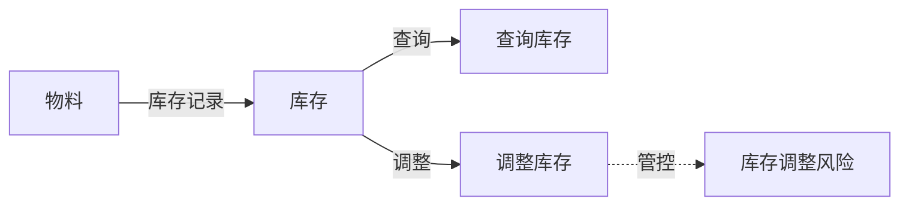

# BKN 语言规范

版本: 2.0.0
spec_version: 2.0.0

## 概述

BKN (Business Knowledge Network) 是一种基于 Markdown 的业务知识网络建模语言，用于描述业务知识网络。本文档定义了 BKN v2.0.0 的语法规范。

v2.0.0 在 v1.0.0 的基础上，将三元组扩展为**四元组**（对象类 / 关系类 / 行动类 / 风险类），引入**内容指纹（checksum）**机制。BKN 是纯粹的知识建模语言，专注于描述业务领域的结构化知识。

### 与 Agent Skill 的关系

BKN 不是 Agent Skill 本身，而是 Skill 的**结构化知识内容层**。BKN 定义通过 agentskills.io 标准的 SKILL.md 包装后，可被所有兼容平台的 Agent 按需加载和使用。具体的集成方式参见 [SKILL_INTEGRATION.md](./SKILL_INTEGRATION.md)。

```
┌─────────────────────────────────────────┐
│  SKILL.md（agentskills.io 标准）         │  ← 指令层：告诉 Agent 怎么做
│  - name, description                     │
│  - 网络拓扑、索引表、使用指南             │
│  - 网络级元信息（id, version, owner）     │
├─────────────────────────────────────────┤
│  .bkn 文件（BKN 语言规范）               │  ← 知识层：告诉 Agent 世界是什么样的
│  - 对象类 / 关系类 / 行动类 / 风险类     │
│  - 数据来源、映射规则、参数绑定           │
└─────────────────────────────────────────┘
```

SKILL.md 承担网络级别的编排职责（拓扑概览、索引导航、使用指南）。BKN 语言规范只定义四种叶子类型的语法，不定义网络级别的结构。

### 与 v1.0.0 的兼容性

所有合法的 BKN v1.0.0 文件都是合法的 v2.0.0 文件。v2.0.0 新增的类型和字段均为增量扩展，不修改任何 v1.0.0 已有定义的语义。

| 变更 | 说明 |
|------|------|
| `type: entity` → `type: object` | 术语统一为"对象类"；`entity` 作为别名继续兼容 |
| `## Entity:` → `## Object:` | Markdown Body 标题统一；`## Entity:` 作为别名继续兼容 |
| 新增 `type: risk` | 第四种基本类型——风险类 |
| 新增 `checksum` 字段 | 内容指纹，适用于所有 type，选填 |
| 删除 `type: network` | 网络级编排移至 SKILL.md；原 `type: network` 的单文件场景改用 `type: fragment` |
| `type: delete` 支持 `- risk:` | targets 列表扩展 |
| `type: fragment` 支持 `## Risk:` | fragment body 扩展 |

### 读者路线图（先看什么）

- **业务读者**：先看"对象类定义规范 / 关系类定义规范 / 行动类定义规范 / 风险类定义规范"的示例与表格，再看"最佳实践"和"完整示例"。
- **工程读者**：先看"增量导入规范（确定性语义）"与"校验规则"，再看各类型字段。
- **Agent/大模型**：通过 SKILL.md 导航，按需读取具体的 .bkn 文件，避免一次加载过多内容。

### 术语表（Glossary）

| 术语 | 含义 |
|------|------|
| BKN | Business Knowledge Network，业务知识网络 |
| network / 网络 | 一个业务知识网络的整体集合，由 SKILL.md 定义 |
| object / 对象类 | 业务对象类型（例如 Pod/Node/Service） |
| relation / 关系类 | 连接两个对象类的关系类型（例如 belongs_to/routes_to） |
| action / 行动类 | 对对象类执行的操作定义（可能绑定 tool/mcp） |
| risk / 风险类 | 对行动类和对象类的风险管控定义（审批/模拟/回滚） |
| namespace | 层级分组标识，用 `.` 分隔（例如 `scm.warehouse`） |
| data_view | 数据视图（对象类/关系类可直接映射的数据来源） |
| primary_key | 主键字段（用于唯一定位实例） |
| display_key | 展示字段（用于 UI/检索显示） |
| fragment | 混合片段文件（可包含多个 object/relation/action/risk） |
| delete | 删除标记文件（显式声明要删除的定义） |
| checksum | 内容指纹（SHA-256），用于检测内容一致性 |
| SKILL.md | agentskills.io 标准的 Skill 入口文件，承担网络级编排 |

---

## 文件格式

### 文件扩展名

BKN 文件统一使用 `.bkn` 扩展名。

Agent 通过 SKILL.md 中的链接按需读取 `.bkn` 文件，无需平台原生识别 `.bkn` 扩展名。

### 文件编码

- UTF-8

### 基本结构

每个 BKN 文件由两部分组成：

1. **YAML Frontmatter**: 文件元数据
2. **Markdown Body**: 知识定义内容

```markdown
---
type: object
id: inventory
name: 库存
version: 1.0.0
network: supply-chain
namespace: scm.warehouse
---

# 库存

物料在各仓库中的库存记录。

## Object: inventory

**库存** - 物料的库存记录

### 数据来源

| 类型 | ID |
|------|-----|
| data_view | inventory_view |

> **主键**: `seq_no` | **显示属性**: `material_code`
```

---

## Frontmatter 规范

### 通用字段

以下字段可用于所有 type 的 BKN 文件：

| 字段 | 必填 | 类型 | 说明 |
|------|:----:|------|------|
| `type` | **YES** | string | 文件类型（见"文件类型"表） |
| `id` | **YES** | string | 唯一标识（`type: delete` 除外） |
| `name` | **YES** | string | 显示名称 |
| `version` | NO | string | 版本号（semver），建议填写 |
| `network` | NO | string | 所属网络 ID（建议必填，保证导入确定性） |
| `namespace` | NO | string | 层级分组，用 `.` 分隔（见"命名空间规范"） |
| `spec_version` | NO | string | 该文件使用的规范版本 |
| `owner` | NO | string | 负责人/团队 |
| `tags` | NO | [string] | 标签列表 |
| `description` | NO | string | 描述 |
| `checksum` | NO | string | 内容指纹，格式 `sha256:{64位小写十六进制}` |

### 文件类型 (type)

BKN 定义四种**基本类型**和两种**辅助类型**：

| type | 分类 | 说明 |
|------|------|------|
| `object` | 基本类型 | 对象类定义 |
| `relation` | 基本类型 | 关系类定义 |
| `action` | 基本类型 | 行动类定义 |
| `risk` | 基本类型 | 风险类定义 |
| `fragment` | 辅助类型 | 混合片段，一个文件包含多个定义 |
| `delete` | 辅助类型 | 删除标记，显式声明要删除的定义 |

> **兼容说明**：`type: entity` 作为 `type: object` 的别名继续支持，解析器遇到 `entity` 时应等价处理为 `object`。
>
> **迁移说明**：v1.0.0 的 `type: network` 已废弃。网络级编排（拓扑、索引、使用指南）由 SKILL.md 承担。原 `type: network` 的单文件场景改用 `type: fragment`。

### 命名空间规范

`namespace` 用于在网络内部对定义进行层级分组，使用 `.` 作为分隔符：

```yaml
namespace: scm.warehouse          # 供应链 > 仓储
namespace: scm.procurement        # 供应链 > 采购
namespace: platform.k8s.compute   # 平台 > K8s > 计算资源
```

**语义：**

- `namespace` 是逻辑分组，不强制对应文件系统目录结构
- 同一 `namespace` 下的定义构成一个内聚的子域
- 支持按 namespace 前缀进行批量筛选（如 `scm.*` 匹配所有供应链定义）

**命名规则：**

- 每一级使用小写字母、数字
- 各级之间用 `.` 分隔
- 建议不超过 3 级（如 `domain.subdomain.group`）

**示例 — 一个供应链网络中的 namespace 分组：**

```
supply-chain 网络
├── scm.warehouse         # 仓储子域
│   ├── object: inventory
│   ├── object: warehouse
│   └── action: check_inventory
├── scm.procurement       # 采购子域
│   ├── object: purchase_order
│   └── action: create_purchase_order
└── scm.risk              # 风险管控子域
    └── risk: inventory_adjustment_risk
```

### 单对象类文件 (type: object)

| 字段 | 必填 | 类型 | 说明 |
|------|:----:|------|------|
| `type` | **YES** | string | 固定为 `object` |
| `id` | **YES** | string | 对象类 ID，唯一标识 |
| `name` | **YES** | string | 对象类显示名称 |
| `version` | NO | string | 版本号 |
| `network` | NO | string | 所属网络 ID（建议必填） |
| `namespace` | NO | string | 层级分组 |
| `owner` | NO | string | 负责人/团队 |
| `checksum` | NO | string | 内容指纹 |
| `tags` | NO | [string] | 标签列表 |

### 单关系类文件 (type: relation)

| 字段 | 必填 | 类型 | 说明 |
|------|:----:|------|------|
| `type` | **YES** | string | 固定为 `relation` |
| `id` | **YES** | string | 关系类 ID，唯一标识 |
| `name` | **YES** | string | 关系类显示名称 |
| `version` | NO | string | 版本号 |
| `network` | NO | string | 所属网络 ID（建议必填） |
| `namespace` | NO | string | 层级分组 |
| `owner` | NO | string | 负责人/团队 |
| `checksum` | NO | string | 内容指纹 |

### 单行动类文件 (type: action)

| 字段 | 必填 | 类型 | 说明 |
|------|:----:|------|------|
| `type` | **YES** | string | 固定为 `action` |
| `id` | **YES** | string | 行动类 ID，唯一标识 |
| `name` | **YES** | string | 行动类显示名称 |
| `action_type` | **YES** | string | 行动类型：`add` / `modify` / `delete` |
| `version` | NO | string | 版本号 |
| `network` | NO | string | 所属网络 ID（建议必填） |
| `namespace` | NO | string | 层级分组 |
| `owner` | NO | string | 负责人/团队 |
| `enabled` | NO | boolean | 是否启用（建议默认 `false`，导入不等于启用） |
| `risk_level` | NO | string | 风险等级：`low` / `medium` / `high` |
| `requires_approval` | NO | boolean | 是否需要审批才能启用/执行 |
| `checksum` | NO | string | 内容指纹 |

### 单风险类文件 (type: risk)

| 字段 | 必填 | 类型 | 说明 |
|------|:----:|------|------|
| `type` | **YES** | string | 固定为 `risk` |
| `id` | **YES** | string | 风险类 ID，唯一标识 |
| `name` | **YES** | string | 风险类显示名称 |
| `version` | NO | string | 版本号 |
| `network` | NO | string | 所属网络 ID（建议必填） |
| `namespace` | NO | string | 层级分组 |
| `owner` | NO | string | 负责人/团队 |
| `checksum` | NO | string | 内容指纹 |

### 混合片段 (type: fragment)

当多个定义放在单个文件中时，使用 fragment 类型：

| 字段 | 必填 | 类型 | 说明 |
|------|:----:|------|------|
| `type` | **YES** | string | 固定为 `fragment` |
| `id` | **YES** | string | 片段 ID |
| `name` | **YES** | string | 片段名称 |
| `version` | NO | string | 版本号 |
| `network` | NO | string | 所属网络 ID（建议必填） |
| `namespace` | NO | string | 层级分组 |
| `owner` | NO | string | 负责人/团队 |
| `checksum` | NO | string | 内容指纹 |

示例：

```markdown
---
type: fragment
id: supply-chain-core
name: 供应链核心定义
version: 1.0.0
network: supply-chain
---

# 供应链核心定义

## Object: material
**物料** - 供应链中的基础业务对象
...

## Object: inventory
**库存** - 物料的库存记录
...

## Relation: material_to_inventory
**物料库存** - 物料对应的库存记录
...

## Action: check_inventory
**查询库存** - 查询物料的当前库存状况
...

## Risk: inventory_adjustment_risk
**库存调整风险** - 管控库存调整操作
...
```

### 删除标记 (type: delete)

| 字段 | 必填 | 类型 | 说明 |
|------|:----:|------|------|
| `type` | **YES** | string | 固定为 `delete` |
| `network` | NO | string | 目标网络 ID（建议必填） |
| `namespace` | NO | string | 层级分组 |
| `owner` | NO | string | 负责人/团队 |
| `targets` | **YES** | [object] | 要删除的定义列表 |

`targets` 列表格式：

```yaml
targets:
  - object: pod
  - relation: pod_belongs_node
  - action: restart_pod
  - risk: pod_restart_risk
```

---

## 对象类定义规范

### 语法

```markdown
## Object: {object_id}

**{显示名称}** - {简短描述}

### 数据来源

| 类型 | ID | 名称 |
|------|-----|------|
| data_view | {view_id} | {view_name} |

> **主键**: `{primary_key}` | **显示属性**: `{display_key}`

### 属性覆盖

(可选) 仅声明需要特殊配置的属性

| 属性名 | 显示名 | 索引配置 | 说明 |
|--------|--------|----------|------|
| ... | ... | ... | ... |

### 逻辑属性

#### {property_name}

- **类型**: metric | operator
- **来源**: {source_id} ({source_type})
- **说明**: {description}

| 参数名 | 来源 | 绑定值 |
|--------|------|--------|
| ... | property | {property_name} |
| ... | input | - |
```

### 字段说明

| 字段 | 必须 | 说明 |
|------|:----:|------|
| object_id | YES | 对象类唯一标识，小写字母、数字、下划线 |
| 显示名称 | YES | 人类可读名称 |
| 数据来源 | YES | 映射的数据视图 |
| 主键 | YES | 主键属性名 |
| 显示属性 | YES | 用于展示的属性名 |
| 属性覆盖 | NO | 需要特殊配置的属性 |
| 逻辑属性 | NO | 指标、算子等扩展属性 |

### 配置模式

#### 模式一：完全映射（最简洁）

直接映射视图，自动继承所有字段：

```markdown
## Object: node

**Node节点**

### 数据来源

| 类型 | ID |
|------|-----|
| data_view | view_123 |

> **主键**: `id` | **显示属性**: `node_name`
```

#### 模式二：映射 + 属性覆盖

映射视图，仅声明需要特殊配置的属性：

```markdown
## Object: pod

**Pod实例**

### 数据来源

| 类型 | ID |
|------|-----|
| data_view | view_456 |

> **主键**: `id` | **显示属性**: `pod_name`

### 属性覆盖

| 属性名 | 索引配置 |
|--------|----------|
| pod_status | fulltext + vector |
```

#### 模式三：完整定义

完整声明所有属性：

```markdown
## Object: service

**Service服务**

### 数据来源

| 类型 | ID |
|------|-----|
| data_view | view_789 |

### 数据属性

| 属性名 | 显示名 | 类型 | 说明 | 主键 | 索引 |
|--------|--------|------|------|:----:|:----:|
| id | ID | int64 | 主键 | YES | YES |
| service_name | 名称 | VARCHAR | 服务名 | | YES |

> **显示属性**: `service_name`
```

---

## 关系类定义规范

### 语法

```markdown
## Relation: {relation_id}

**{显示名称}** - {简短描述}

| 起点 | 终点 | 类型 |
|------|------|------|
| {source_object} | {target_object} | direct | data_view |

### 映射规则

| 起点属性 | 终点属性 |
|----------|----------|
| {source_prop} | {target_prop} |

### 业务语义

(可选) 关系的业务含义说明...
```

### 字段说明

| 字段 | 必须 | 说明 |
|------|:----:|------|
| relation_id | YES | 关系类唯一标识 |
| 起点 | YES | 起点对象类 ID |
| 终点 | YES | 终点对象类 ID |
| 类型 | YES | `direct`（直接映射）或 `data_view`（视图映射） |
| 映射规则 | YES | 属性映射关系 |

### 关系类型

#### 直接映射 (direct)

通过属性值匹配建立关联：

```markdown
## Relation: pod_belongs_node

| 起点 | 终点 | 类型 |
|------|------|------|
| pod | node | direct |

### 映射规则

| 起点属性 | 终点属性 |
|----------|----------|
| pod_node_name | node_name |
```

#### 视图映射 (data_view)

通过中间视图建立关联：

```markdown
## Relation: user_likes_post

| 起点 | 终点 | 类型 |
|------|------|------|
| user | post | data_view |

### 映射视图

| 类型 | ID |
|------|-----|
| data_view | user_post_likes_view |

### 起点映射

| 起点属性 | 视图属性 |
|----------|----------|
| user_id | uid |

### 终点映射

| 视图属性 | 终点属性 |
|----------|----------|
| pid | post_id |
```

---

## 行动类定义规范

### 语法

```markdown
## Action: {action_id}

**{显示名称}** - {简短描述}

| 绑定对象 | 行动类型 |
|----------|----------|
| {object_id} | add | modify | delete |

### 触发条件

```yaml
field: {property_name}
operation: == | != | > | < | >= | <= | in | not_in | exist | not_exist
value: {value}
```

### 工具配置

| 类型 | 工具ID |
|------|--------|
| tool | {tool_id} |

或

| 类型 | MCP |
|------|-----|
| mcp | {mcp_id}/{tool_name} |

### 参数绑定

| 参数 | 来源 | 绑定 |
|------|------|------|
| {param_name} | property | {property_name} |
| {param_name} | input | - |
| {param_name} | const | {value} |

### 调度配置

(可选)

| 类型 | 表达式 |
|------|--------|
| FIX_RATE | {interval} |
| CRON | {cron_expr} |

### 执行说明

(可选) 详细的执行流程说明...
```

### 治理要求（强烈建议）

行动类连接执行面（tool/mcp），为了稳定性与安全性，建议在每个 Action 中**显式写清**以下四类信息，并在工程侧落地相应治理：

1. **触发**：何时触发（手动/定时/条件触发），触发条件是否可复现
2. **影响范围**：影响哪些对象、范围边界、预期副作用
3. **权限与前置条件**：谁可以导入/启用/执行，是否需要审批，依赖的权限/凭据
4. **回滚/失败策略**：失败处理、重试策略、熔断/限流、可撤销性

> 推荐实践：导入不等于启用；启用与执行需要独立的权限与审计日志，并能关联到对应的 BKN 定义版本。
>
> 对于 `risk_level: high` 的行动，**强烈建议**创建对应的 Risk 定义（见"风险类定义规范"），将治理要求结构化而非仅以自然语言描述。

### 字段说明

| 字段 | 必须 | 说明 |
|------|:----:|------|
| action_id | YES | 行动类唯一标识 |
| 绑定对象 | YES | 目标对象类 ID |
| 行动类型 | YES | `add` / `modify` / `delete` |
| 触发条件 | NO | 自动触发的条件 |
| 工具配置 | YES | 执行的工具或 MCP |
| 参数绑定 | YES | 参数来源配置 |
| 调度配置 | NO | 定时执行配置 |

### 触发条件操作符

| 操作符 | 说明 | 示例 |
|--------|------|------|
| == | 等于 | `value: Running` |
| != | 不等于 | `value: Running` |
| > | 大于 | `value: 100` |
| < | 小于 | `value: 100` |
| >= | 大于等于 | `value: 100` |
| <= | 小于等于 | `value: 100` |
| in | 包含于 | `value: [A, B, C]` |
| not_in | 不包含于 | `value: [A, B, C]` |
| exist | 存在 | (无需 value) |
| not_exist | 不存在 | (无需 value) |
| range | 范围内 | `value: [0, 100]` |

### 参数来源

| 来源 | 说明 |
|------|------|
| property | 从对象类属性获取 |
| input | 运行时用户输入 |
| const | 常量值 |

---

## 风险类定义规范

### 概述

风险类（Risk Type）是 v2.0.0 新增的第四种基本类型，用于对行动类和对象类的执行风险进行结构化建模。

**设计原则：**

- 风险类是独立类型，不是行动类的附属字段。Action 的 `risk_level` 声明"多危险"，Risk 声明"如何管控"。
- 一个风险类可管控多个行动类，实现统一的风险策略。
- 导入不等于启用，启用不等于执行。风险类为行动类的生命周期管控提供结构化依据。

### 语法

```markdown
## Risk: {risk_id}

**{显示名称}** - {简短描述}

### 管控范围

| 管控对象 | 管控行动 | 风险等级 |
|----------|----------|----------|
| {object_id} | {action_id} | low | medium | high |

### 管控策略

| 条件 | 策略 |
|------|------|
| {condition_description} | {strategy_description} |

### 前置检查

(可选)

| 检查项 | 类型 | 说明 |
|--------|------|------|
| {check_name} | permission | {description} |
| {check_name} | simulation | {description} |
| {check_name} | approval | {description} |
| {check_name} | precondition | {description} |

### 回滚方案

(可选) 失败或误操作时的恢复策略说明...

### 审计要求

(可选) 审计日志、告警通知等要求说明...
```

### 字段说明

| 字段 | 必须 | 说明 |
|------|:----:|------|
| risk_id | YES | 风险类唯一标识，小写字母、数字、下划线 |
| 显示名称 | YES | 人类可读名称 |
| 管控范围 | YES | 关联的对象类、行动类及风险等级 |
| 管控策略 | YES | 按条件分级的管控规则（至少一条） |
| 前置检查 | NO | 执行前检查项列表 |
| 回滚方案 | NO | 失败恢复策略 |
| 审计要求 | NO | 审计日志与告警配置 |

### 风险等级

| 等级 | 含义 | 默认管控 |
|------|------|---------|
| `low` | 只读查询或无副作用操作 | 无需审批，直接执行 |
| `medium` | 有副作用但可撤销的操作 | 建议确认，记录审计日志 |
| `high` | 不可逆或高影响操作 | 必须审批 + 行动模拟 + 完整审计 |

### 前置检查类型

| 类型 | 说明 |
|------|------|
| `permission` | 检查执行者是否有权限 |
| `simulation` | 执行行动模拟，预估影响范围 |
| `approval` | 发起审批流程，等待批准 |
| `precondition` | 自定义前置条件检查 |

---

## 内容指纹（Checksum）规范

### 定义级 Checksum

#### 计算规则

1. 取 BKN 文件 Frontmatter `---` 分隔符之后的全部内容（Markdown Body）
2. 去除首尾空白（trim）
3. 统一换行符为 `\n`（LF）
4. 计算 UTF-8 字节的 SHA-256 哈希
5. 格式为 `sha256:{64位小写十六进制}`

#### 语义

| 场景 | 说明 |
|------|------|
| 一致性校验 | `version` 相同但 `checksum` 不同 = 内容被无意修改，标记为不一致 |
| 传输完整性 | 文件在系统间传输后，校验 checksum 确认内容未损坏 |
| 幂等优化 | 导入时比较 checksum，未变化则跳过处理 |
| 缓存键 | 解析结果可按 `(id, checksum)` 缓存 |

#### 校验规则

- `checksum` 为选填字段。未填写时，导入器不做内容校验
- 填写时，导入器**必须**验证实际内容与声明值一致，不一致则 fail-fast
- 同一 `(network, type, id)`，`version` 变更时 `checksum` 应同步变更

### 网络级 Checksum（CHECKSUM 文件）

网络的整体一致性通过独立的 `CHECKSUM` 文件保障，不污染 SKILL.md。

`CHECKSUM` 文件由工具链生成和维护（如 `bkn checksum` 命令），不需要手工编辑。

#### 文件格式

```
# BKN Network Checksum
# network: supply-chain
# version: 1.0.0
# generated: 2026-03-05T10:30:00Z

# network checksum (sha256 of all entries below)
sha256:7a3b9f2e...  *

# definition checksums (type:id = file)
sha256:a1b2c3d4...  objects/material.bkn
sha256:e5f6a7b8...  objects/inventory.bkn
sha256:c9d0e1f2...  relations/material_to_inventory.bkn
sha256:3a4b5c6d...  actions/check_inventory.bkn
sha256:7e8f9a0b...  actions/adjust_inventory.bkn
sha256:1c2d3e4f...  risks/inventory_adjustment_risk.bkn
```

格式说明：

- `#` 开头为注释行，包含网络元信息和生成时间
- 每行格式为 `{sha256_hash}  {path}`（两个空格分隔，兼容 `sha256sum` 工具输出）
- `*` 表示网络级聚合 checksum
- 各定义按文件路径字典序排列

#### 网络级 Checksum 计算规则

1. 收集网络中所有 `.bkn` 文件，按文件路径字典序排序
2. 对每个文件计算定义级 checksum（取 Markdown Body 的 SHA-256）
3. 拼接为 `{checksum}  {relative_path}\n` 格式的字符串
4. 对拼接结果计算 SHA-256，得到网络级聚合 checksum

#### 语义

| 场景 | 说明 |
|------|------|
| 网络一致性 | 任何一个 .bkn 文件的内容变化，网络级 checksum 就会变化 |
| 部署校验 | 部署到新环境后，运行 `bkn checksum --verify` 比对，确认所有文件完整 |
| 版本快照 | `(version, network_checksum)` 唯一标识网络的一个确定状态 |
| 文件缺失检测 | CHECKSUM 中列出的文件必须全部存在，缺失即报错 |

#### 校验规则

- `CHECKSUM` 文件为可选。不存在时，不做网络级校验
- 存在时，校验器**必须**逐文件重新计算并与声明值比对，不一致则报错
- 网络版本（SKILL.md `metadata.bkn_network_version`）变更时，应重新生成 `CHECKSUM` 文件

#### 工具链集成

```bash
# 生成 CHECKSUM 文件
bkn checksum --generate .claude/skills/supply-chain/

# 校验一致性
bkn checksum --verify .claude/skills/supply-chain/

# CI 中使用
bkn checksum --verify . || exit 1
```

---

## 能力层级（架构概念）

BKN 文件可在不同能力层级的环境中使用。这是架构层面的概念，不作为 BKN 文件的字段。

| 层级 | 名称 | 宿主环境 | 使用方式 | 能力 |
|------|------|---------|---------|------|
| **L1** | 裸读 | 任意 LLM Agent | Agent 通过 SKILL.md 导航，按需读取 .bkn 文件为 Markdown | 自然语言理解执行 |
| **L2** | 结构化解析 | 支持 BKN 解析器的框架 | 解析 Frontmatter，提取结构化定义 | L1 + 引用校验 + 按需加载 + 版本 diff + checksum 校验 |
| **L3** | 全能力 | 知识网络引擎（如 Kweaver） | 导入知识网络，绑定数据源和工具 | L2 + 实例查询 + 子图遍历 + 逻辑属性计算 + 行动模拟 + 风险评估 |

### 向下兼容

- L3 环境**必须**能处理 L1 和 L2 的文件
- L2 环境**必须**能处理 L1 的文件
- L1 环境可以读取任何层级的文件（作为 Markdown），但无法利用结构化特性

---

## 通用语法元素

### 表格格式

使用标准 Markdown 表格：

```markdown
| 列1 | 列2 | 列3 |
|-----|-----|-----|
| 值1 | 值2 | 值3 |
```

居中对齐（用于布尔值）：

```markdown
| 列1 | 列2 |
|-----|:---:|
| 值1 | YES |
```

### YAML 代码块

用于复杂结构（如条件表达式）：

````markdown
```yaml
condition:
  operation: and
  sub_conditions:
    - field: status
      operation: ==
      value: Failed
    - field: retry_count
      operation: <
      value: 3
```
````

### Mermaid 图表

用于可视化关系（在 SKILL.md 中使用，BKN 文件本身通常不需要）：

````markdown

````

### 引用块

用于关键信息高亮：

```markdown
> **主键**: `id` | **显示属性**: `name`
```

### 标题层级

- `#` - 文件标题
- `##` - 类型定义 (Object/Relation/Action/Risk)
- `###` - 定义内的主要 section
- `####` - 逻辑属性名等子项

---

## 文件组织

### 推荐模式：每定义一文件

每个对象类/关系类/行动类/风险类独立一个 `.bkn` 文件，通过 SKILL.md 作为网络入口：

```
.claude/skills/supply-chain/
├── SKILL.md                           # agentskills.io 标准入口（网络级编排）
├── CHECKSUM                           # 网络级一致性校验（工具链生成）
├── objects/
│   ├── material.bkn                   # type: object
│   └── inventory.bkn                  # type: object
├── relations/
│   └── material_to_inventory.bkn      # type: relation
├── actions/
│   ├── check_inventory.bkn            # type: action
│   └── adjust_inventory.bkn           # type: action
└── risks/
    └── inventory_adjustment_risk.bkn  # type: risk
```

### 单文件模式（小型网络）

定义数量少于 20 个时，可将所有定义放在一个 fragment 文件中：

```
.claude/skills/supply-chain/
├── SKILL.md                           # agentskills.io 标准入口
├── CHECKSUM                           # 网络级一致性校验（工具链生成，可选）
└── definitions.bkn                    # type: fragment，包含所有定义
```

### 目录结构约定

| 目录 | 内容 |
|------|------|
| `objects/` | 对象类定义 |
| `relations/` | 关系类定义 |
| `actions/` | 行动类定义 |
| `risks/` | 风险类定义 |

目录名是约定而非强制，文件的 `type` 字段才是定义类型的权威声明。

### 部署位置

部署位置遵循各平台约定：

| 平台 | 路径 |
|------|------|
| Claude Code | `.claude/skills/{skill-name}/SKILL.md` |
| Cursor | `.cursor/skills/{skill-name}/SKILL.md` |
| GitHub Copilot | `.github/skills/{skill-name}/SKILL.md` |
| 个人全局 | `~/.claude/skills/{skill-name}/SKILL.md` |

SKILL.md 的编写方式参见 [SKILL_INTEGRATION.md](./SKILL_INTEGRATION.md)。

---

## 增量导入规范

BKN 支持将任何 `.bkn` 文件动态导入到已有的知识网络。

### 导入器能力要求

建议实现一个 **BKN Importer**，将 BKN 文件转换为系统变更，并提供以下能力：

| 能力 | 说明 | 目的 |
|------|------|------|
| `validate` | 结构/表格/YAML block 校验，引用完整性校验，参数绑定校验，**风险完整性校验** | 阻止错误进入系统 |
| `diff` | 计算变更集（新增/更新/删除）与影响范围 | 让变更可解释、可审计 |
| `dry_run` | 在不落地的情况下执行 validate + diff | 上线前预演 |
| `apply` | 执行落地（按确定性语义与冲突策略） | 可控执行 |
| `export` | 将线上知识网络状态导出为 BKN（可 round-trip） | 防漂移、可回滚、可复现 |

> 要求：所有导入操作必须记录审计信息（操作者、时间、输入文件指纹、变更集、结果）。

### 导入的确定性（必须保证）

为保证多人协作与可回放性，导入语义必须是**确定性的（deterministic）**：

- 对同一组输入文件（不考虑文件系统顺序）导入结果一致
- 同一文件重复导入结果一致（幂等）
- 冲突可解释：要么明确失败（fail-fast），要么有明确规则（例如 last-wins），不得"隐式合并"

### 唯一键与作用域

每个定义的唯一键为：

- `key = (network, type, id)`

其中 `network` 取自：

- 优先使用 frontmatter `network` 字段
- 若缺失，则由导入命令参数指定的目标网络补齐

`namespace` 不参与唯一键计算，它是分组标签而非作用域隔离。同一网络内的 `id` 必须唯一，不论 namespace。

### 更新语义（replace vs merge）

默认建议使用 **replace（整段覆盖）**：

- 当 `key` 已存在时，用导入文件中的定义整体替换旧定义
- **缺失字段不代表删除**：仅代表"该字段不在本次定义中"；删除必须显式声明（见 `type: delete`）

如确有需要，可支持受控的 **merge-by-section（按章节合并）**，但必须满足：

- 仅允许合并少数"附加型章节"（例如 `属性覆盖`、`逻辑属性`）
- 冲突必须可控：同名逻辑属性/同名字段配置冲突时 fail-fast 或 last-wins（需配置）
- 合并策略必须在导入器中显式配置并记录到导入审计日志

### 冲突与优先级

当同一个 `key` 在一次导入批次中被多个文件重复声明：

- 默认：**fail-fast**（推荐，保证稳定性）
- 可选：按显式优先级排序（例如命令行顺序或 `priority` 字段），否则不建议支持

### Checksum 导入优化

当导入器支持 checksum 时：

1. 比较目标网络中已有定义的 checksum 与导入文件的 checksum
2. 若 checksum 一致，跳过该定义的处理（幂等优化）
3. 若 checksum 不一致或目标无 checksum，按正常流程处理

### 导入行为

| 场景 | 行为 |
|------|------|
| ID 不存在 | 创建新定义 |
| ID 已存在 | 更新定义（覆盖） |
| 使用 `type: delete` | 删除指定定义 |

---

## Patch 规范（文件级别）

### 添加操作

```markdown
---
type: patch
id: 2026-01-31-add-metric
target: objects/pod.bkn
operation: add
---

# 添加CPU指标

在 `## Object: pod` 的 `### 逻辑属性` 后添加：

#### cpu_usage

- **类型**: metric
- **来源**: cpu_metric
```

### 修改操作

````markdown
---
type: patch
id: 2026-01-31-update-condition
target: actions/restart_pod.bkn
operation: modify
---

# 更新触发条件

将 `## Action: restart_pod` 的触发条件修改为：

```yaml
field: pod_status
operation: in
value: [Unknown, Failed, CrashLoopBackOff]
```
````

### 删除操作

```markdown
---
type: patch
id: 2026-01-31-remove-action
target: actions/deprecated_action.bkn
operation: delete
---

# 删除废弃行动

删除 `## Action: deprecated_action`
```

---

## 校验规则

### 结构校验

| 规则 | 适用类型 | 严重级别 |
|------|---------|---------|
| Frontmatter 包含必填字段 `type`、`id`、`name` | all（delete 除外） | ERROR |
| Markdown Body 中的表格格式合法 | all | ERROR |
| YAML 代码块语法合法 | all | ERROR |
| `namespace` 格式合法（小写字母、数字、`.` 分隔） | all | ERROR |

### 引用完整性校验

| 规则 | 说明 | 严重级别 |
|------|------|---------|
| Relation 引用的起点/终点对象类必须存在 | 关系的端点必须已定义 | ERROR |
| Action 绑定的对象类必须存在 | 行动的操作对象必须已定义 | ERROR |
| Risk 管控范围中的对象类必须存在 | 风险管控的对象必须已定义 | ERROR |
| Risk 管控范围中的行动类必须存在 | 风险管控的行动必须已定义 | ERROR |
| Action 参数绑定的 property 应在目标对象类上存在 | 参数来源可达 | WARNING |

### 风险完整性校验

| 规则 | 说明 | 严重级别 |
|------|------|---------|
| `risk_level: high` 的 Action 应关联至少一个 Risk | 高危行动应有管控定义 | WARNING |
| Risk 的管控策略不能为空 | 至少声明一条管控规则 | ERROR |

### Checksum 校验

| 规则 | 说明 | 严重级别 |
|------|------|---------|
| checksum 格式合法 | 必须为 `sha256:{64位十六进制}` | ERROR |
| checksum 与实际内容一致 | 计算值与声明值匹配 | ERROR |
| version 变更时 checksum 应变更 | 同 id 下 version 不同但 checksum 相同 | WARNING |

### SKILL.md 一致性校验

| 规则 | 说明 | 严重级别 |
|------|------|---------|
| SKILL.md 索引表中引用的 .bkn 文件必须存在 | 索引与实际文件保持同步 | ERROR |
| .bkn 文件中的 id 应与 SKILL.md 索引表中的 ID 一致 | 防止索引信息陈旧 | WARNING |

### 网络级 Checksum 校验

| 规则 | 说明 | 严重级别 |
|------|------|---------|
| CHECKSUM 文件中列出的 .bkn 文件必须全部存在 | 检测文件缺失 | ERROR |
| 每个 .bkn 文件的实际 checksum 与 CHECKSUM 声明值一致 | 检测内容篡改 | ERROR |
| 网络级聚合 checksum 与 CHECKSUM 声明值一致 | 网络整体一致性 | ERROR |
| 目录中的 .bkn 文件应全部出现在 CHECKSUM 中 | 检测未登记的新文件 | WARNING |

---

## 最佳实践

### 命名规范

- **ID**: 小写字母、数字、下划线，如 `pod_belongs_node`
- **显示名称**: 简洁明确，如 "Pod属于节点"
- **namespace**: 层级分组，用 `.` 分隔，不超过 3 级，如 `scm.warehouse`
- **标签**: 使用统一的标签体系

### 文档结构

1. 每个 .bkn 文件只包含一个定义（推荐）
2. 网络描述和拓扑图放在 SKILL.md 中
3. 目录按 objects/relations/actions/risks 组织
4. 相关定义使用相同的 namespace 分组

### 简洁原则

- 优先使用完全映射模式
- 只在需要时声明属性覆盖
- 避免重复信息

### 风险建模

- 每个 `risk_level: high` 的 Action 都应有对应的 Risk 定义
- Risk 的管控策略应按条件分级，避免"一刀切"
- 回滚方案应具体到操作步骤，不要只写"回滚"
- 审计要求应明确记录哪些字段

---

## 完整示例：供应链库存管理

以下是一个完整的供应链库存管理示例，采用"每定义一文件"模式，并通过 SKILL.md 包装为 Agent Skill。

### 文件结构

```
.claude/skills/supply-chain/
├── SKILL.md                           # agentskills.io 标准入口
├── CHECKSUM                           # 网络级一致性校验（工具链生成）
├── objects/
│   ├── material.bkn                   # type: object - 物料
│   └── inventory.bkn                  # type: object - 库存
├── relations/
│   └── material_to_inventory.bkn      # type: relation - 物料→库存
├── actions/
│   ├── check_inventory.bkn            # type: action - 查询库存（低风险）
│   └── adjust_inventory.bkn           # type: action - 调整库存（高风险）
└── risks/
    └── inventory_adjustment_risk.bkn  # type: risk - 库存调整风险管控
```

### SKILL.md

```yaml
---
name: supply-chain
description: |
  供应链领域的业务知识网络。涵盖物料、库存管理，
  支持库存查询、库存调整等操作。
  Use when the user asks about supply chain, inventory,
  materials, or procurement.
metadata:
  bkn_spec_version: "2.0.0"
  bkn_network_id: supply-chain
  bkn_network_version: "1.0.0"
  owner: scm-team
  source: "scm-team/supply-chain-skill@v1.0.0"
---

# 供应链管理

本技能基于 BKN 知识网络，提供供应链领域的结构化业务知识。



## 对象类

| ID | 名称 | 分组 | 文件 |
|----|------|------|------|
| material | 物料 | scm.warehouse | [objects/material.bkn](objects/material.bkn) |
| inventory | 库存 | scm.warehouse | [objects/inventory.bkn](objects/inventory.bkn) |

## 关系类

| ID | 起点 → 终点 | 文件 |
|----|------------|------|
| material_to_inventory | material → inventory | [relations/material_to_inventory.bkn](relations/material_to_inventory.bkn) |

## 行动类

| ID | 名称 | 风险等级 | 分组 | 文件 |
|----|------|---------|------|------|
| check_inventory | 查询库存 | low | scm.warehouse | [actions/check_inventory.bkn](actions/check_inventory.bkn) |
| adjust_inventory | 调整库存 | high | scm.warehouse | [actions/adjust_inventory.bkn](actions/adjust_inventory.bkn) |

## 风险类

| ID | 管控行动 | 分组 | 文件 |
|----|---------|------|------|
| inventory_adjustment_risk | adjust_inventory | scm.risk | [risks/inventory_adjustment_risk.bkn](risks/inventory_adjustment_risk.bkn) |

## 使用指南

1. 根据用户问题，从上方表格定位相关的对象类或行动类
2. 读取对应的 .bkn 文件获取详细定义（数据结构、参数绑定等）
3. 对 risk_level: low 的行动，可直接执行
4. 对 risk_level: high 的行动，必须先读取对应的风险类文件，按管控策略执行
5. requires_approval: true 的行动需要人工审批，不可自动执行
```

### objects/material.bkn

```markdown
---
type: object
id: material
name: 物料
version: 1.0.0
network: supply-chain
namespace: scm.warehouse
owner: scm-team
---

# 物料

企业生产和经营中使用的原材料、半成品、成品等。

## Object: material

**物料** - 供应链中的基础业务对象

### 数据来源

| 类型 | ID |
|------|-----|
| data_view | material_view |

> **主键**: `id` | **显示属性**: `material_code`
```

### objects/inventory.bkn

```markdown
---
type: object
id: inventory
name: 库存
version: 1.0.0
network: supply-chain
namespace: scm.warehouse
owner: scm-team
---

# 库存

物料在各仓库中的库存记录。

## Object: inventory

**库存** - 物料的库存记录

### 数据来源

| 类型 | ID |
|------|-----|
| data_view | inventory_view |

> **主键**: `seq_no` | **显示属性**: `material_code`

### 属性覆盖

| 属性名 | 索引配置 |
|--------|----------|
| material_code | fulltext |
| warehouse | fulltext |
```

### relations/material_to_inventory.bkn

```markdown
---
type: relation
id: material_to_inventory
name: 物料库存
version: 1.0.0
network: supply-chain
namespace: scm.warehouse
---

# 物料库存

物料与库存记录之间的关联关系。

## Relation: material_to_inventory

**物料库存** - 物料对应的库存记录

| 起点 | 终点 | 类型 |
|------|------|------|
| material | inventory | direct |

### 映射规则

| 起点属性 | 终点属性 |
|----------|----------|
| material_code | material_code |

### 业务语义

一个物料可以在多个仓库中有库存记录。通过 `material_code` 字段关联。
```

### actions/check_inventory.bkn

```markdown
---
type: action
id: check_inventory
name: 查询库存
action_type: modify
version: 1.0.0
network: supply-chain
namespace: scm.warehouse
risk_level: low
enabled: true
---

# 查询库存

查询指定物料的当前库存状况。

## Action: check_inventory

**查询库存** - 查询物料的当前库存状况

| 绑定对象 | 行动类型 |
|----------|----------|
| inventory | modify |

### 工具配置

| 类型 | 工具ID |
|------|--------|
| tool | query_object_instance |

### 参数绑定

| 参数 | 来源 | 绑定 |
|------|------|------|
| material_code | input | - |

### 执行说明

根据用户提供的物料编码，查询该物料在各仓库的库存数量和可用库存。返回结果包含仓库名称、库存数量、可用库存数量。
```

### actions/adjust_inventory.bkn

```markdown
---
type: action
id: adjust_inventory
name: 调整库存
action_type: modify
version: 1.0.0
network: supply-chain
namespace: scm.warehouse
risk_level: high
requires_approval: true
enabled: false
owner: scm-team
---

# 调整库存

调整指定物料在指定仓库的库存数量。

## Action: adjust_inventory

**调整库存** - 修改库存数量

| 绑定对象 | 行动类型 |
|----------|----------|
| inventory | modify |

### 工具配置

| 类型 | 工具ID |
|------|--------|
| tool | modify_object_instance |

### 参数绑定

| 参数 | 来源 | 绑定 |
|------|------|------|
| seq_no | property | seq_no |
| material_code | property | material_code |
| warehouse | property | warehouse |
| adjust_qty | input | - |
| reason | input | - |

### 执行说明

1. 根据 seq_no 定位库存记录
2. 将库存数量调整 adjust_qty（正数为增加，负数为减少）
3. 必须填写调整原因（reason），用于审计
```

### risks/inventory_adjustment_risk.bkn

```markdown
---
type: risk
id: inventory_adjustment_risk
name: 库存调整风险管控
version: 1.0.0
network: supply-chain
namespace: scm.risk
owner: scm-risk-team
---

# 库存调整风险管控

管控库存数量变更操作的执行风险。

## Risk: inventory_adjustment_risk

**库存调整风险** - 管控库存调整操作

### 管控范围

| 管控对象 | 管控行动 | 风险等级 |
|----------|----------|----------|
| inventory | adjust_inventory | high |
| inventory | check_inventory | low |

### 管控策略

| 条件 | 策略 |
|------|------|
| 调整数量绝对值 <= 1000 | 需直属主管审批 |
| 调整数量绝对值 > 1000 | 需部门总监审批 + 行动模拟 |
| 调整数量绝对值 > 10000 | 需 VP 审批 + 行动模拟 + 二次确认 |

### 前置检查

| 检查项 | 类型 | 说明 |
|--------|------|------|
| 库存操作权限 | permission | 检查执行者是否有库存调整权限 |
| 库存影响评估 | simulation | 模拟调整后的库存状态，预估对生产计划的影响 |
| 主管审批 | approval | 调整数量超过阈值时触发审批流程 |

### 回滚方案

库存调整失败或误操作时，通过反向调整单恢复原值。所有变更记录审计日志，包含调整前后的快照。反向调整单自动关联原始调整单号。

### 审计要求

每次库存调整操作必须记录：操作者、时间、调整对象（物料编码+仓库）、调整数量、调整前值、调整后值、调整原因、关联审批单号。审计日志保留期限不少于 3 年。
```

### 四元组闭环

上述示例展示了 BKN 四种基本类型如何协作：

```
物料(Object) ──物料库存(Relation)──→ 库存(Object)     认知层
  　                                    ↑
  　                          查询库存(Action, low)      执行层
  　                          调整库存(Action, high)
  　                                    ↑
  　                     库存调整风险(Risk)               治理层
```

- **对象类**（material、inventory）描述"世界是什么"
- **关系类**（material_to_inventory）描述"对象之间怎么连接"
- **行动类**（check_inventory、adjust_inventory）描述"可以做什么"
- **风险类**（inventory_adjustment_risk）描述"允许做什么、怎么管控"

Agent 通过 SKILL.md 导航到这组文件，读取后就知道：查库存（`risk_level: low`）可以直接执行，调库存（`risk_level: high, requires_approval: true, enabled: false`）需要走审批链路且默认未启用。这个判断不是靠 Agent 的"常识"，而是靠结构化的声明。

---

## 参考

- [BKN 语言规范 v1.0.0](./SPECIFICATION.md)
- [架构设计](./ARCHITECTURE.md)
- [BKN as Enhanced Skill](./BKN_AS_ENHANCED_SKILL.md) - 设计动机与立论
- [SKILL 集成指南](./SKILL_INTEGRATION.md) - 如何将 BKN 网络包装为 agentskills.io 标准 Skill
- 样例：
  - [单文件模式](./examples/supply-chain-fragment.bkn) - 所有定义在一个 fragment 文件
  - [每定义一文件](./examples/supply-chain/) - 每个定义独立文件（推荐）
